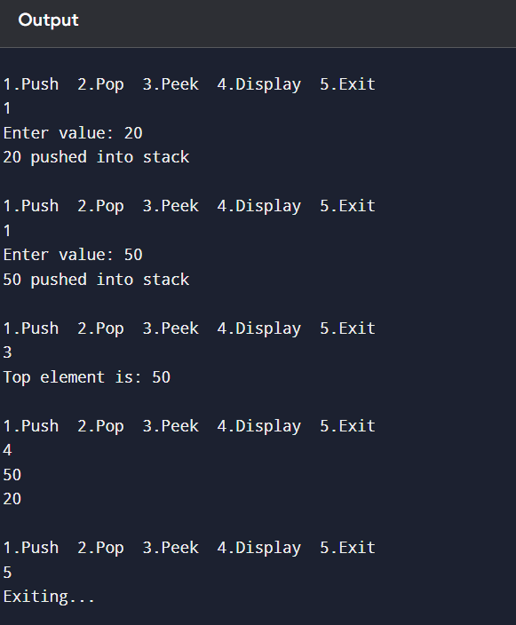

## Part C: Stack Implementation Using Array (Java)

```java
import java.util.Scanner;

class Stack {
    int max = 5;
    int top = -1;
    int[] stack = new int[max];

    void push(int value) {
        if (top == max - 1) {
            System.out.println("Stack Overflow");
        } else {
            stack[++top] = value;
            System.out.println(value + " pushed into stack");
        }
    }

    void pop() {
        if (top == -1) {
            System.out.println("Stack Underflow");
        } else {
            System.out.println(stack[top] + " popped from stack");
            top--;
        }
    }

    void peek() {
        if (top == -1) {
            System.out.println("Stack is Empty");
        } else {
            System.out.println("Top element is: " + stack[top]);
        }
    }

    void display() {
        if (top == -1) {
            System.out.println("Stack is Empty");
        } else {
            for (int i = top; i >= 0; i--) {
                System.out.println(stack[i]);
            }
        }
    }
}

public class StackUsingArray {
    public static void main(String[] args) {
        Scanner sc = new Scanner(System.in);
        Stack s = new Stack();

        int choice;

        do {
            System.out.println("\n1.Push  2.Pop  3.Peek  4.Display  5.Exit");
            choice = sc.nextInt();

            switch (choice) {
                case 1:
                    System.out.print("Enter value: ");
                    int value = sc.nextInt();
                    s.push(value);
                    break;
                case 2:
                    s.pop();
                    break;
                case 3:
                    s.peek();
                    break;
                case 4:
                    s.display();
                    break;
                case 5:
                    System.out.println("Exiting...");
                    break;
                default:
                    System.out.println("Invalid Choice");
            }
        } while (choice != 5);
    }
}
```

## Program Output Screenshot



