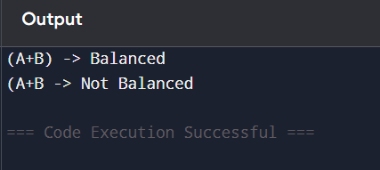

# Part B: Coding Activity 1 – Balanced Parentheses

## Algorithm

1. Create an empty stack.
2. Traverse the expression.
3. If '(' is found, push it into stack.
4. If ')' is found:
   - If stack is empty → Not Balanced
   - Else pop from stack.
5. After traversal:
   - If stack is empty → Balanced
   - Else → Not Balanced

---

## Java Program

```java
import java.util.*;

public class BalancedParentheses {

    public static boolean isBalanced(String exp) {
        Stack<Character> stack = new Stack<>();

        for (int i = 0; i < exp.length(); i++) {
            char ch = exp.charAt(i);

            if (ch == '(') {
                stack.push(ch);
            } 
            else if (ch == ')') {
                if (stack.isEmpty()) {
                    return false;
                }
                stack.pop();
            }
        }
        return stack.isEmpty();
    }

    public static void main(String[] args) {
        String input1 = "(A+B)";
        String input2 = "(A+B";

        System.out.println(input1 + " -> " + 
            (isBalanced(input1) ? "Balanced" : "Not Balanced"));

        System.out.println(input2 + " -> " + 
            (isBalanced(input2) ? "Balanced" : "Not Balanced"));
    }
}
```

## Program Output Screenshot


