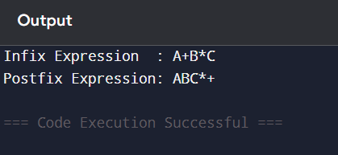

# Part C: Coding Activity 2 – Infix to Postfix Conversion

## Objective

To convert an Infix expression into a Postfix expression using Stack.

---

## Theory

In an Infix expression, the operator is written between operands.

Example:
A + B

In a Postfix expression, the operator is written after operands.

Example:
A B +

Postfix expressions are easier for computers to evaluate because they do not require parentheses or precedence rules during evaluation.

---

## Algorithm

1. Create an empty stack to store operators.
2. Create an empty string for output.
3. Traverse the infix expression from left to right.
4. If the character is an operand:
   - Add it to the output.
5. If the character is '(':
   - Push it into the stack.
6. If the character is ')':
   - Pop from the stack and add to output until '(' is found.
   - Remove '(' from stack.
7. If the character is an operator:
   - While stack is not empty and precedence of stack top is greater than or equal to current operator:
     - Pop from stack and add to output.
   - Push current operator to stack.
8. After traversal, pop all remaining operators from stack and add to output.
9. Return the postfix expression.

---

## Java Program

```java
import java.util.*;

public class InfixToPostfix {

    static int precedence(char ch) {
        if (ch == '+' || ch == '-') return 1;
        if (ch == '*' || ch == '/') return 2;
        return -1;
    }

    public static String convert(String exp) {
        Stack<Character> stack = new Stack<>();
        String result = "";

        for (int i = 0; i < exp.length(); i++) {
            char ch = exp.charAt(i);

            if (Character.isLetterOrDigit(ch)) {
                result += ch;
            }

            else if (ch == '(') {
                stack.push(ch);
            }

            else if (ch == ')') {
                while (!stack.isEmpty() && stack.peek() != '(') {
                    result += stack.pop();
                }
                stack.pop();
            }

            else {
                while (!stack.isEmpty() &&
                       precedence(ch) <= precedence(stack.peek())) {
                    result += stack.pop();
                }
                stack.push(ch);
            }
        }

        while (!stack.isEmpty()) {
            result += stack.pop();
        }

        return result;
    }

    public static void main(String[] args) {

        String exp = "A+B*C";

        System.out.println("Infix Expression  : " + exp);
        System.out.println("Postfix Expression: " + convert(exp));
    }
}

```

## Program Output Screenshot

