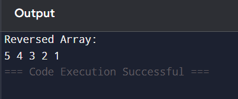

# Part D: Stack Challenge – Reverse Array Using Stack

## Objective

To reverse the elements of an integer array using Stack.

---

## Theory

A Stack follows the LIFO (Last In First Out) principle.

When we push all elements of an array into a stack:

- The last element of the array will be on the top of the stack.
- When we pop elements from the stack, they come out in reverse order.

Thus, using a stack naturally reverses the array.

---

## Algorithm

1. Create an empty stack.
2. Traverse the array.
3. Push all elements into the stack.
4. Traverse the array again.
5. Pop elements from the stack and store them back into the array.
6. Print the reversed array.

---

## Java Program

```java
import java.util.*;

public class ReverseArrayUsingStack {

    public static void main(String[] args) {

        int[] arr = {1, 2, 3, 4, 5};

        Stack<Integer> stack = new Stack<>();

        for (int i = 0; i < arr.length; i++) {
            stack.push(arr[i]);
        }

        int index = 0;
        while (!stack.isEmpty()) {
            arr[index++] = stack.pop();
        }

        System.out.println("Reversed Array:");

        for (int i = 0; i < arr.length; i++) {
            System.out.print(arr[i] + " ");
        }
    }
}
```

## Program Output Screenshot

